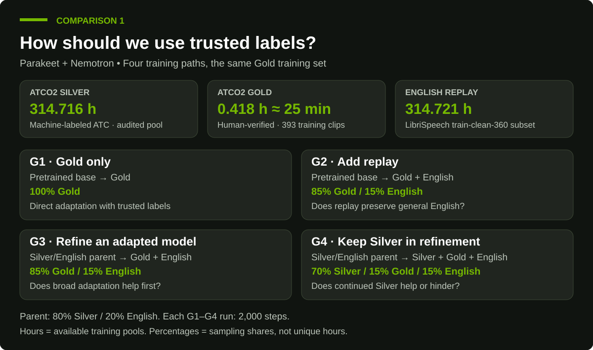
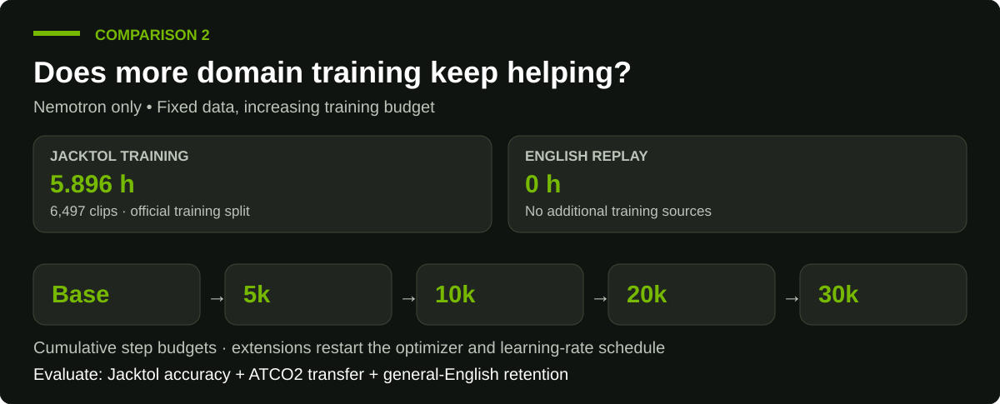
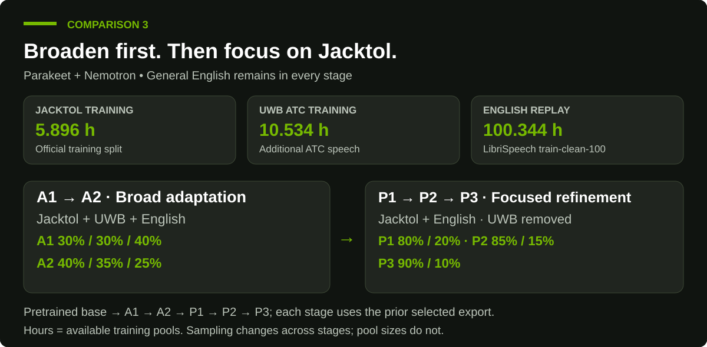

| Article overview | Working title: Fine-Tune ASR for Your Domain with NVIDIA Nemotron Speech Skills Format: Hands-on developer tutorial Draft deadline: October 2, 2026 (requested by Michelle Horton) Length: Under 1,400 words Target publication: October 13, 2026, alongside the livestream, pending editorial confirmation |
| :---- | :---- |
| **Submitter’s notes** | **Author / submitter:** Francesco Ciannella **Jira:** [TECHBLOG-5795](https://nvidia.atlassian.net/browse/TECHBLOG-5795) **Scope:** Use the Nemotron ASR fine-tuning skills with a coding agent to adapt a pretrained ASR model to domain-specific audio, using air traffic control (ATC) as the worked example. Cover data preparation, NeMo training, and baseline versus fine-tuned evaluation. **Community contribution:** NVIDIA plans to release a two-hour, human-annotated ATC dataset alongside the blog and livestream, giving developers and researchers data and guidance to build on. **Release links:** Dataset, skills, example code, and staging/publication links pending. **Results:** Exact model, dataset splits, training setup, and WER results to be verified against experiment artifacts. |
| **Editorial and technical review** | **Pitch reviewer:** Michelle Horton (confirmed by Elizabeth Goodman) **Editorial contact:** Elizabeth Goodman (cw) **Proposed reviewers / contacts:** [Maryam Motamedi US](mailto:maryamm@nvidia.com), [Adi Margolin US](mailto:amargolin@nvidia.com), @Maryam Motamedi, Adi Margolin, Jayda Ritchie — specific responsibilities to be confirmed. **Review status:** Michelle requested a draft under 1,400 words by October 2\. Publication timing remains subject to review. |
| **Campaign / livestream coordination** | **Livestream:** October 13, 2026 **Livestream details:** Maryam Motamedi and Rebecca Kao **PMM lead and campaign reviewers:** To be confirmed |
| **Awareness / outstanding details** | Confirm dataset documentation, license, download location, and how the released two-hour dataset relates to the experimental training, validation, and test splits. Verify measured results and reproducible example links before publication. |
| **Social copy — draft for review** | **LinkedIn:** Adapt speech recognition to your domain with NVIDIA Nemotron Speech skills. This hands-on ATC example walks through preparing data, fine-tuning with NeMo, and evaluating recognition quality. Alongside the blog, NVIDIA plans to release two hours of human-annotated ATC data to help the community experiment and build on the work. Join the October 13 livestream for more. \[Blog, dataset, and livestream links pending\] **X:** Fine-tune ASR for your domain with NVIDIA Nemotron Speech skills. Explore the ATC workflow and a planned community release of two hours of human-annotated ATC data. Join the October 13 livestream. \[Links pending\] |

| Feedback Deadline: 10/09/26 Target Publish Date: 10/13/26 |  |
| ----- | :---- |
| **Submitters Notes:** | Please see above |
| **Formal Reviewers** | **Formal Reviewers: [Maryam Motamedi US](mailto:maryamm@nvidia.com) [Adi Margolin US](mailto:amargolin@nvidia.com)[Yitagessu Gebremedhin US](mailto:ygebremedhin@nvidia.com)[Myungjong Kim US](mailto:myungjongk@nvidia.com)[Jinhan Wang US](mailto:jinhanw@nvidia.com)[Rajpreet Thethy (cw) US](mailto:rthethy@nvidia.com)**  |
| **Awareness (CC)** | [Chintan Patel US](mailto:cpatel@nvidia.com)[Udi Karpas IL](mailto:ekarpas@nvidia.com)[Davide Onofrio US](mailto:donofrio@nvidia.com)[Will Jennings US](mailto:wjennings@nvidia.com) |

# **Fine-Tune ASR for Your Domain with NVIDIA Nemotron Speech Skills**

Suppose a speech recognition model transcribes everyday conversation accurately, yet struggles with a pilot reading back a clearance. The model already knows English. What it needs to learn is how English sounds over a radio and how people use it in air traffic control. Fine-tuning lets us teach those differences by updating a pretrained model with examples from the new domain.

The challenge is deciding what to teach, how much to change, and how to check that existing capabilities survive. We explored those questions using air traffic control (ATC) speech and two NVIDIA agent skills. We compare Parakeet and Nemotron using human-verified labels and staged training, then examine how longer domain-only training affects Nemotron. We measure recognition quality with word error rate (WER), which counts substitutions, deletions, and insertions relative to the reference transcript. Lower is better.

# **How the skills guide the work**

Think of a skill as a reusable set of instructions for a coding agent. It helps the agent ask the right questions, carry out the work in a sensible order, and collect the evidence needed to judge the result.

You can use the two skills together to move from an adaptation goal to a trained and evaluated model:

| [`nemotron-asr-finetune`](https://github.com/NVIDIA/skills/tree/main/skills/nemotron-asr-finetune) — plan and coordinate adaptation | [`nemo-speech-asr-finetune`](https://github.com/NVIDIA-NeMo/Speech/tree/main/.claude/skills/nemo-speech-asr-finetune) — train and evaluate with NeMo |
| :---- | :---- |
| **Define success:** Turn a domain or language request into accuracy targets, latency constraints, and a baseline evaluation plan. | **Inspect your model:** Identify its architecture, tokenizer, and preprocessing, then choose a compatible NeMo recipe and environment. |
| **Choose an approach:** Decide whether word boosting, vocabulary support, an n-gram language model, or acoustic fine-tuning fits the measured errors. | **Prepare training data:** Check manifests and transcript conventions, configure Lhotse loaders, and mix domain audio with general-speech replay. |
| **Plan resources:** Assess available audio, label quality, GPU capacity, and time/cost trade-offs; identify missing inputs before expensive work. | **Configure and run training:** Set learning rate, batch sizing, step budget, validation, and checkpoint retention for the chosen model. |
| **Protect existing capabilities:** Define domain and general-speech checks so better domain accuracy does not hide catastrophic forgetting. | **Measure the result:** Evaluate exported checkpoints with normalized WER on domain and general speech, independently of training logs. |
| **Choose the next experiment:** Use measured errors and constraints to prioritize data, training, or decoding changes and route specialist work. | **Refine the model:** Adjust replay or curriculum and compare individual and averaged checkpoints, keeping changes only when evaluation supports them. |
| **Coordinate delivery:** Hand off serving and endpoint evaluation to the deployment skill when the selected model meets the objective. | **Produce reviewable artifacts:** Retain training configurations, checkpoints, exported `.nemo` models, and standalone evaluation results. |

The orchestration skill coordinates specialist execution; serving through Riva/NIM requires the `nemotron-speech` skill. Both skills run through your coding agent with access to your data, software environment, and hardware.

Together, the skills connect experiment planning with execution. Each training run has a reason, a defined dataset, and a test that can tell us whether the change helped.

## **Where we used the skills in this study**

`nemotron-asr-finetune` helped frame the experiments and assess ATC gains alongside English retention. `nemo-speech-asr-finetune` guided data preparation, model-specific training, and checkpoint evaluation. We chose the experiment budgets and recipes; the skills guided the coding agent through implementation and analysis.

## **Prerequisites**

You need a coding agent supporting Agent Skills, Node.js/npm, Git, and a Linux GPU host with NVIDIA drivers, NVIDIA Container Toolkit, and a compatible NeMo ASR environment. Prepare a licensed `.nemo` checkpoint, readable audio, separate training/development/test manifests, and storage for checkpoints. JSONL rows need `audio_filepath`, `duration`, and `text`.

Pin the software and model versions, and check GPU memory before training. The skills guide the coding agent; they do not provision hardware or install the training environment.

## **Install and activate the skills**

Follow the [NVIDIA skills installation flow](https://github.com/NVIDIA/skills#quickstart):

```sh
npx skills@latest add NVIDIA/skills --skill nemotron-asr-finetune
npx skills@latest add NVIDIA-NeMo/Speech --skill nemo-speech-asr-finetune
npx skills@latest list
```

Choose your agent and installation scope, then start a fresh agent session and confirm both skills are available.

Explicitly name both in a prompt. This sample is illustrative; replace the paths with your files:

```textproto
Use nemotron-asr-finetune and nemo-speech-asr-finetune to adapt /models/base.nemo to ATC. Human-verified training and development manifests are /data/atc/train.jsonl and /data/atc/dev.jsonl; keep /data/atc/test.jsonl locked until selection is complete. English replay is /data/english/train.jsonl; the general evaluation is /data/librispeech/test-clean.jsonl. Audit transcript style and overlap, inspect the checkpoint and GPUs, and measure baseline WER. If acoustic training is justified, propose a conservative pilot with replay. Preserve tokenizer and preprocessing. Save the effective configuration, manifest hashes, exported model, predictions, and baseline-versus-adapted WER report in /exp/atc. Report missing inputs before launching training.
```

## **Choose the architecture as part of the product decision**

Before choosing a recipe, inspect the checkpoint. Its encoder, decoder, tokenizer, feature normalization, and loss function were designed and trained to work together.

| Architecture | Basic idea | Practical implication |
| :---- | :---- | :---- |
| CTC | Predict frame-level tokens, then collapse blanks and repetitions | Parallelizable decoding and convenient external-LM integration |
| RNN-T | Combine an acoustic encoder with a prediction and joint network | Streaming-friendly and conditioned on previously emitted tokens |
| TDT | Extend the transducer family with token-and-duration outputs | Efficient sequence modeling with architecture-specific duration settings |

Our experiments used Nemotron 3.5 ASR Streaming 0.6B, Parakeet CTC 1.1B, and Parakeet TDT 0.6B v3. Each required a compatible training recipe. CTC can be attractive for offline decoding and language-model integration, while a streaming transducer may suit an application that must respond as someone speaks. Choose with the intended application in mind, then compare accuracy. Parakeet is a separate model family in this comparison. Preserve the CTC head and tokenizer, RNN-T loss and streaming configuration, or TDT duration vocabulary and decoder settings, as appropriate for the checkpoint.

When adapting within the same language, keeping the pretrained tokenizer is usually the safest starting point. If a replacement is needed, train it only on training text. Input normalization deserves similar care: changing our completed Nemotron checkpoint from global to per-feature normalization without retraining sharply increased WER on both ATC and general speech. The lesson was to preserve the preprocessing the model had learned to expect.

# **Why ATC is a demanding adaptation problem**

ATC speech concentrates several ASR challenges in one domain:

* narrow-band radio, interference, clipping, and variable gain;
* short, context-dependent transmissions;
* accents and non-native English;
* callsigns, runways, headings, altitudes, and frequencies;
* specialized, compressed phraseology;
* number or callsign errors that are more consequential than ordinary conversational substitutions.

Both the sound and the language differ from ordinary conversation. An adapted model may nevertheless need to recognize general English too, so we measured those two capabilities throughout the study.

## **Three ingredients in the training data**

Before looking at the experiments, distinguish **how transcripts were produced** from **how the data are used**:

| Ingredient | Labels and source | Amount used | Purpose |
| --- | --- | --- | --- |
| **ATCO2 Silver** | High-confidence, machine-generated ATC transcripts; labels can still contain errors | **314.721 h** filtered pool; **314.716 h** after the overlap audit used for the Gold experiments | Broad adaptation to radio speech and aviation language |
| **ATCO2 Gold** | Human-verified ATC transcripts | **0.418 h training** (393 clips), **0.100 h development**, **2.000 h test** | Trusted-label refinement, checkpoint selection, and separate evaluation |
| **English replay** | **LibriSpeech** general-English training audio | **314.721 h** selected from `train-clean-360` for Comparison 1; **100.344 h** from `train-clean-100` for Comparison 3; **none** in Comparison 2 | Preserve general-English recognition during ATC fine-tuning |

Silver and Gold describe label quality, not dataset splits. Gold training, development, and test audio have separate roles; only the training split updates model weights. Replay hours describe available source pools, not how many hours are sampled in a run. LibriSpeech `test-clean` is reserved for evaluation, not replay.

## **Know which data is being released**

The documented community-release plan covers **two hours of human-annotated ATCO2 evaluation data**, containing 1,908 segments. It does not currently include the study's 0.418-hour Gold training set, 0.100-hour Gold development set, or licensed 314.7-hour Silver training corpus. The download URL, license, and final packaging remain pending release-owner confirmation. Keep the community evaluation data out of training and model selection.

For a public starting point, the [Jacktol ATC-ASR dataset](https://huggingface.co/datasets/jacktol/ATC-ASR-Dataset) provides official training, validation, and test splits under its dataset-card terms. Alternatively, supply your own licensed recordings. Audit overlap before comparing Jacktol with ATCO2. New data means a new experiment, not reproduction of the historical scores.

## **ATCO2 and Jacktol provide different evidence**

The ATCO2 delivery contained 3,088,603 recordings and approximately 4,281.9 hours. Filtering for language, duration, confidence, text, and audio quality produced a 314.721-hour English Silver training pool with 396,461 segments. The smaller human-Gold pool was assigned to non-overlapping roles:

| Split | Audio | Segments | Role |
| :---- | :---- | :---- | :---- |
| Gold training | 0.418 h | 393 | Final supervised refinement |
| Gold development | 0.100 h | 100 | Checkpoint and recipe selection |
| Gold community test | 2.000 h | 1,908 | Held out from training/selection; reused comparison benchmark |

The splits had zero overlap by airport-date, audio path, record ID, and source recording. Reserving two hours for evaluation left about 25 minutes for Gold training. That was a deliberate trade-off: we wanted enough held-out speech to assess what the model had learned.

The public [Jacktol ATC-ASR dataset](https://huggingface.co/datasets/jacktol/ATC-ASR-Dataset) contains 7.405 hours, including about 5.9 training hours and official validation and test splits. It supplied an external comparison and training-only domain text. Because it includes material derived from public ATCO2 recordings, cross-corpus claims required an acoustic overlap audit.

### **Listen to the data**

These clips illustrate aviation phraseology and the reference-transcript conventions in each dataset. They are examples, not a ranking of recording quality. Jacktol preserves uppercase labels; our ATCO2 Gold manifests use lowercase. Our WER normalizer ignores that casing difference.

| Dataset / split | Listen | Reference transcript |
| :---- | :---- | :---- |
| ATCO2 Gold community test · Sion | [▶ 5.02 s — taxi request](http://libra.nvidia.com:8508/api/dataset-comparison/audio/atco2_gold/atco2-lsgs-162034-001#t=0.14,5.16) · internal review | “hotel hotel victor runway two five vacate interception charlie request taxi” |
| Jacktol test · row 0 | [▶ 1.51 s — acknowledgment](https://huggingface.co/datasets/jacktol/ATC-ASR-Dataset/viewer/default/test?row=0) | “HOTEL HOTEL BRAVO THANK YOU” |
| Jacktol test · row 1 | [▶ 1.90 s — direct routing](https://huggingface.co/datasets/jacktol/ATC-ASR-Dataset/viewer/default/test?row=1) | “DIRECT RATEV LUFTHANSA EIGHT MIKE MIKE THANK YOU” |

For Jacktol, open the linked row and press its audio play button. ATCO2 links require access to the internal network; the [comparison player](http://libra.nvidia.com:8508/#comparison) also provides playback with segment boundaries. The public ATCO2 sample links will be added when the evaluation dataset is released.

<!-- Publication handoff: replace internal ATCO2 URLs with approved release assets and use the blog platform's native audio player with the same reference captions. Use English-only ATCO2 examples. Export only the selected Sion segment, 0.14–5.16 seconds, not the full source recording. GitHub review uses listening links; do not rely on embedded HTML audio rendering in Markdown. Jacktol source revision: 075e736bf8aed80579d829092f74355486b10bc7; test row IDs: 00a81de9d20f87d04465 and 00CRZ17A8RNXPWNUA6TD. Preserve references verbatim. Sample selection is illustrative and does not change training or evaluation. -->

## **What we wanted to learn**

Our goal was to improve ATC recognition while preserving general English. Each comparison asks a different question:

| Comparison | Question | Models |
| --- | --- | --- |
| **1 · Label quality and replay** | How should we use a small amount of trusted ATCO2 data? | Parakeet + Nemotron |
| **2 · Training duration** | What happens if we keep training on Jacktol alone? | Nemotron |
| **3 · Training sequence** | Can broad ATC training followed by focused refinement improve the balance? | Parakeet + Nemotron |

Development data selected checkpoints. We evaluated the exported models on the same test sets within each comparison, using normalized WER and LibriSpeech as the general-English check.

# **What the Parakeet and Nemotron experiments showed**

We tested the same Gold-refinement strategies and staged curriculum with **Parakeet TDT 0.6B v3** and **Nemotron 3.5 ASR Streaming 0.6B**. Both use greedy decoding here, without an external language model. Parakeet operates offline; Nemotron uses native streaming. These are matched experimental designs, not identical runs or an architecture-only ranking: pretraining, tokenizers, and execution details differ.

Scores come from the [Parakeet Gold results](../reports/experiment-study.json), [Parakeet curriculum results](../reports/jacktol-gold-study.json), and [Nemotron results](../reports/nemotron-comparisons-2026-10-07.json). They are repeated benchmark comparisons, not fresh blind tests. All reported error rates are WER; lower is better. **Base** means the untouched pretrained checkpoint: `nvidia/parakeet-tdt-0.6b-v3` for Parakeet or `nemotron-3.5-asr-streaming-0.6b.nemo` for Nemotron. Training data below describe our adaptation after that checkpoint, not the models’ original pretraining corpora.

## **Comparison 1: What do Gold labels and English replay each contribute?**

We had plenty of machine-labeled ATCO2 audio but only about 25 minutes of human-verified training audio. **Should we train directly on those trusted labels, or first adapt on the larger Silver pool? And where does English replay help?**



**Read the branches:** G1 vs G2 tests adding replay; G2 vs G3 tests prior Silver adaptation; G3 vs G4 tests keeping Silver during the final correction. We repeat all four strategies for both models, using the same 393 Gold training segments and a 2,000-step refinement budget. Gold development selects checkpoints.

**Measure:** ATCO2 test WER for domain accuracy, alongside LibriSpeech test-clean WER for English retention.

| Run / seed | Starting checkpoint → adaptation data | Parakeet ATCO2 | Nemotron ATCO2 | Parakeet English | Nemotron English |
| --- | --- | ---: | ---: | ---: | ---: |
| **Pretrained baseline** | **Base → no adaptation** | — | 77.00% | — | 3.50% |
| Silver/English parent | Base → 314.716 h Silver + 314.721 h English (80/20 sampling) | 30.28% | 36.52% | 2.18% | 3.48% |
| G1 / 1234 | Base → 0.418 h Gold only | 26.44% | 26.09% | 10.91% | 5.16% |
| G2 / 1234 | Base → 0.418 h Gold + 314.721 h English (85/15) | 24.30% | 26.89% | 2.67% | 3.72% |
| G3 / 1234 | Silver/English parent → same Gold + English pools (85/15) | 20.51% | 22.97% | 2.41% | 3.68% |
| G3 / 42 | Silver/English parent → same Gold + English pools (85/15) | 20.00% | 22.46% | 2.31% | 3.63% |
| G4 / 1234 | Silver/English parent → Silver + Gold + English pools (70/15/15) | 27.45% | 30.08% | 2.38% | 3.54% |
| G4 / 42 | Silver/English parent → Silver + Gold + English pools (70/15/15) | 27.38% | 30.69% | 2.24% | 3.56% |

Hours are source-pool sizes; ratios are sampling percentages. **—** means a matching pretrained-baseline result is unavailable in the cited comparison snapshot; it does not mean zero. We do not substitute scores from a different ATCO2 evaluation split.

Both models tell the same story: **English replay limits forgetting, and Gold refinement works best after broad adaptation.** Adding replay to Gold-only training reduces English WER from 10.91% to 2.67% for Parakeet and from 5.16% to 3.72% for Nemotron. G3 reaches 20.00% and 22.46% ATCO2 WER respectively at seed 42, improving on both parents. Keeping Silver in the final mixture (G4) weakens that correction in both seeds.

The historical training data remain separate from the planned evaluation-data release; these results do not establish that 25 minutes will suffice for every domain.

## **Comparison 2: Does more Jacktol-only training keep helping Nemotron?**

This experiment asks whether **more training on the same small dataset keeps improving ATC recognition—and what it costs in general English.** We start from pretrained Nemotron and use only Jacktol's 5.896-hour training split, with no English replay or other training audio.



**Read the progression:** the data stay fixed while training continues. Each extension starts from the previous phase's final weights with a fresh optimizer and schedule; Jacktol validation selects the checkpoint to evaluate at each budget.

**Measure:** Jacktol test WER for specialization, recording-disjoint ATCO2 WER for transfer, and LibriSpeech WER for English retention.

| Completed training budget | Starting checkpoint → adaptation data | Jacktol validation WER | Jacktol test WER | ATCO2 recording-disjoint WER | LibriSpeech WER |
| --- | --- | ---: | ---: | ---: | ---: |
| **Pretrained baseline** | **Nemotron base → no adaptation** | 72.33% | 72.22% | 77.79% | 3.50% |
| 5k steps | Nemotron base → 5.896 h Jacktol only | 14.26% | 14.11% | 29.41% | 6.30% |
| 10k cumulative steps | 5k final checkpoint → same Jacktol pool | 11.43% | 11.01% | 25.27% | 6.86% |
| 20k cumulative steps | 10k final checkpoint → same Jacktol pool | 9.10% | 9.34% | 22.12% | 7.52% |
| 30k cumulative steps | 20k final checkpoint → same Jacktol pool | 8.17% | 8.05% | 20.44% | 7.76% |

Jacktol test WER improves at every reported budget, reaching **8.05%** at 30k. English moves in the opposite direction, reaching **7.76%**, versus 3.50% for the base model. More domain optimization helped specialization but did not solve retention.

Budgets describe completed phases; selected checkpoints may precede their endpoints. Because the optimizer and schedule restart, this comparison measures longer training with restarts rather than step count alone.

The ATCO2 column uses the existing **1,695-segment, 1.749-hour recording-disjoint view**, excluding 213 segments linked to any Jacktol split. It is distinct from the full 1,908-segment, two-hour benchmark in the Gold table. The acoustic audit reduces known overlap; it does not prove that all possible overlap is absent.

## **Comparison 3: Can a staged curriculum improve the balance?**

Comparison 2 exposed a trade-off: better ATC recognition accompanied worse general English. Here we ask whether **training on broader ATC data first, then focusing on Jacktol while retaining English replay, gives a better balance.** We run this curriculum for both Parakeet and Nemotron.



**Read the stages:** A1–A2 blend two ATC sources with general English. P1–P3 drop UWB and progressively emphasize Jacktol. The source pools contain 5.896 hours of Jacktol, 10.534 hours of UWB ATC, and 100.344 hours of English; the percentages below are sampling shares, not additional data. Each stage continues from the previous selected export.

**Measure:** Jacktol test WER alongside LibriSpeech WER. For Nemotron, also compare the outcome with the Jacktol-only run above to assess the combined curriculum's benefit.

| Stage / starting checkpoint | Adaptation data; Jacktol / UWB / English sampling | Parakeet Jacktol test | Nemotron Jacktol test | Parakeet English | Nemotron English |
| --- | --- | ---: | ---: | ---: | ---: |
| **Pretrained baseline / base** | **No adaptation** | — | 72.22% | — | 3.50% |
| A1 / base | 5.896 h Jacktol + 10.534 h UWB + 100.344 h English; 30/30/40 | 9.05% | 11.03% | 3.98% | 5.18% |
| A2 / selected A1 | Same three pools; 40/35/25 | 6.56% | 7.90% | 4.11% | 5.20% |
| P1 / selected A2 | 5.896 h Jacktol + 100.344 h English; 80/0/20 | 6.43% | 7.57% | 4.20% | 5.19% |
| P2 / selected P1 | Same Jacktol + English pools; 85/0/15 | 5.93% | 7.53% | 4.07% | 5.27% |
| P3 / selected P2 | Same Jacktol + English pools; 90/0/10 | 5.91% | 7.31% | 4.10% | 5.30% |

Each model follows its own checkpoint chain. **—** marks pretrained Parakeet scores absent from the cited curriculum snapshot.

Both models improve on Jacktol as the curriculum progresses. Parakeet's historical balanced endpoint was **P2: 5.93% Jacktol and 4.07% English WER**. P3 corrects only two more Jacktol words while slightly worsening English and UWB results, so P2 was retained.

Nemotron P3 has the lowest Jacktol validation WER among its exports and reaches **7.31% Jacktol test WER**, an **89.88% relative reduction** from the 72.22% base. Compared with the 30k Jacktol-only model, it improves Jacktol by **0.74 percentage points** and reduces English WER by **2.46 points**, to 5.30%. Retention is better, but still worse than the original 3.50%; replay has not eliminated forgetting.

The Nemotron duration and curriculum campaigns use the same evaluation audio and normalized references, but change training data, order, budget, and label conventions together. Their difference measures the combined recipe, not replay alone. Across models, matching the curriculum also leaves checkpoint-export and execution differences; it does not isolate architecture.

Nemotron P3 also reaches 20.68% on UWB test and 19.96% on the recording-disjoint ATCO2 view. The ATCO2 transfer claim remains qualified: known Jacktol overlap was removed, but UWB training audio has not received a fresh cross-corpus acoustic audit.

Separate Parakeet decoding experiments reached 17.61% ATCO2 WER with an external language model. That result is outside these greedy-decoding comparisons and is not a Nemotron result.

## **What users can learn from these comparisons**

The skill table maps directly to the experiments. The orchestration skill frames the question and the domain/general evaluation contract; the NeMo skill preserves model-specific settings, configures the data mixture, and evaluates exported checkpoints. The useful output is a comparison that explains the trade-off, not just the lowest domain WER.

For both models, the tested Silver-to-Gold sequence with replay provided the strongest balance among the Gold ablations. For Nemotron on Jacktol, longer domain-only training kept improving specialization while increasing forgetting. The staged curriculum improved on that domain-only model on both measured objectives, although it still regressed on general English. Those are three distinct conclusions, each backed by its own baseline and evaluation set.

## **ATC02 Dataset**

We are releasing a small subset of the larger ATC02 dataset for evaluation purposes. This dataset can be used to evaluate models that the community further fine-tunes.

NVIDIA gratefully acknowledges ELDA (Evaluations and Language resources Distribution Agency) for making the ATCO2 Project Data available to train and test this model checkpoint. The ATCO2 corpus supports research and development in air-traffic-control speech technologies, including automatic speech recognition, speaker diarization, language detection, and related speech and language understanding tasks. The dataset includes air-traffic-control voice communications and associated metadata collected and processed through the ATCO2 project. A 2-hour subset of the larger 5K hour dataset is linked here for evaluation purposes only. To learn more about this dataset, visit [https\://catalog.elra.info/](https://catalog.elra.info/) (Catalogue Reference: ELRA-S0484, ISLRN: 589-403-577-685-7).

## **Try the workflow**

Install the [orchestration skill](https://github.com/NVIDIA/skills/tree/main/skills/nemotron-asr-finetune) and [training skill](https://github.com/NVIDIA-NeMo/Speech/tree/main/.claude/skills/nemo-speech-asr-finetune), and start with licensed domain data or [Jacktol](https://huggingface.co/datasets/jacktol/ATC-ASR-Dataset). Measure both domain gains and general-English retention.
